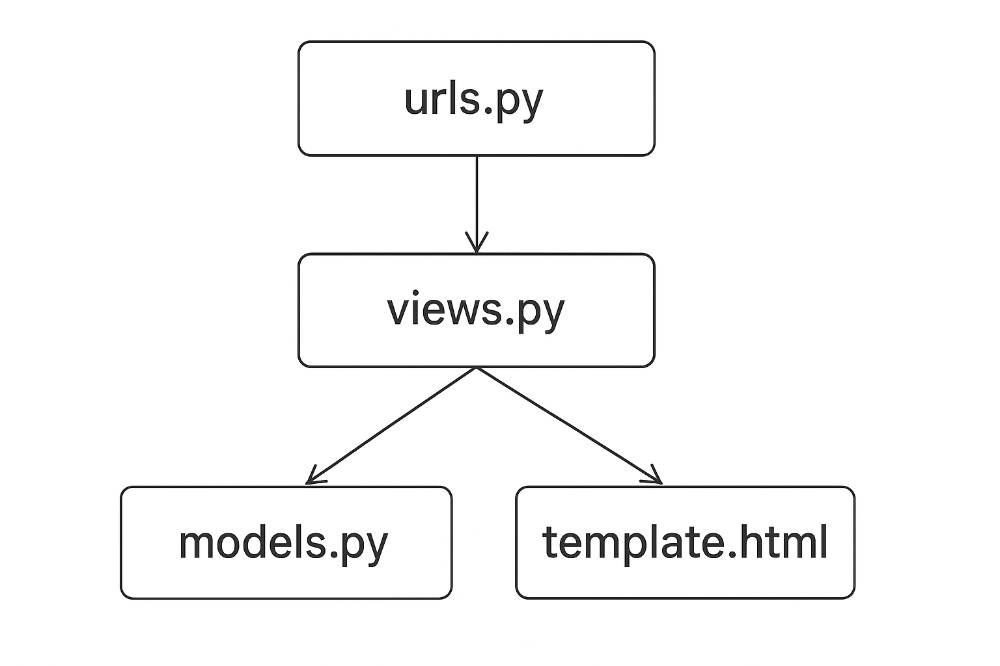
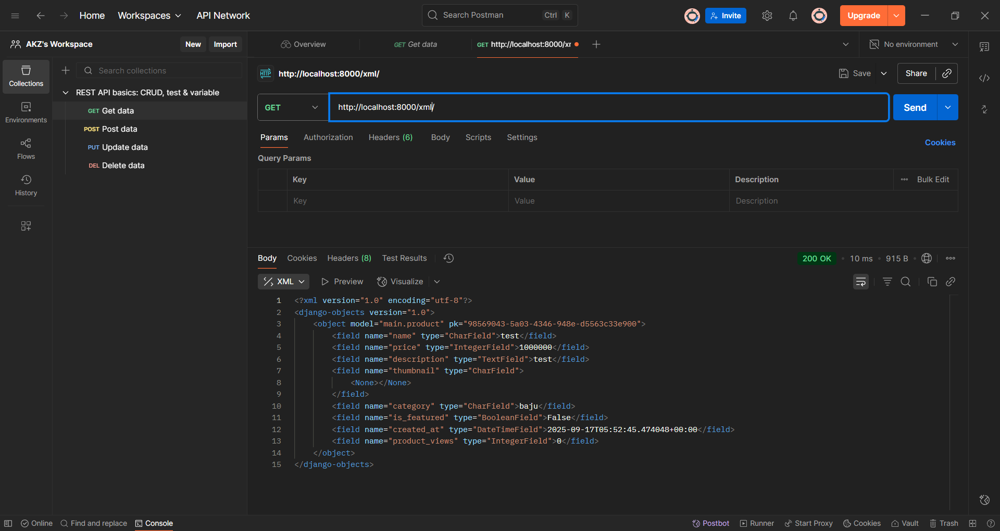
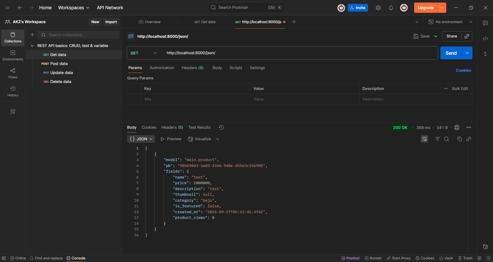
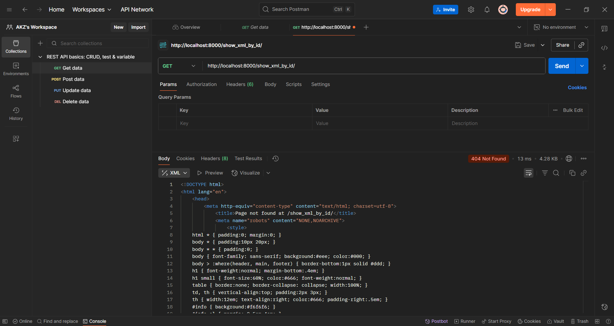
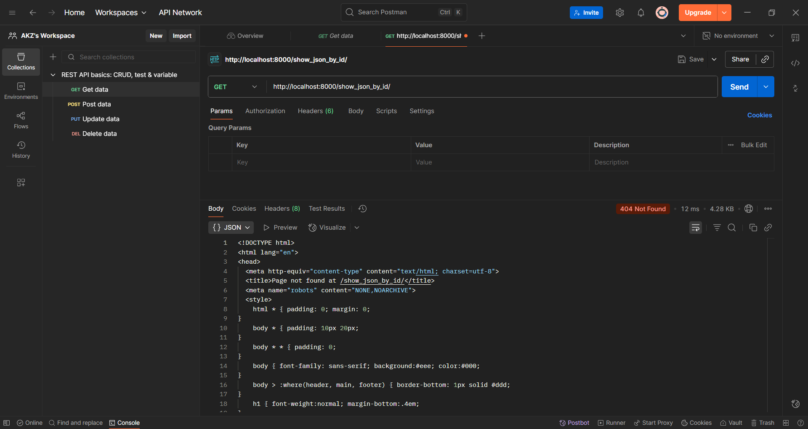
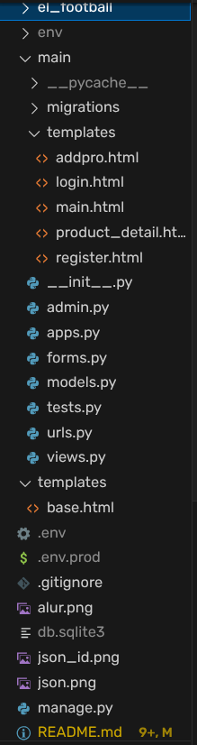

# El Football - Toko Perlengkapan Sepak Bola
## Tugas Individu PBP - Kelas C - 2406431510 - Muhammad Azka Awliya 

Aplikasi dapat diakses melalui tautan berikut: https://muhammad-azka41-elfootball.pbp.cs.ui.ac.id/ \
Nama Aplikasi: El Football

# Esai Tugas 2

## 1. Jelaskan bagaimana cara kamu mengimplementasikan checklist di atas secara step-by-step (bukan hanya sekadar mengikuti tutorial).

1. Membuat Proyek Django Baru
   
   ```
   django-admin startproject el_football
   ```

2. Membuat Aplikasi Baru dengan Nama main

    ```
    python manage.py startapp main
    ```

    Folder main otomatis membentuk beberapa file standar django seperti _ _ init _ _.py, admin.py, apps.py, models.py, tests.py, urls.py, dan views.py.

3. Melakukan Routing Aplikasi main ke Proyek

    - Menambah main ke dalam INSTALLED_APPS di settings.py
    - Membuat file urls.py di dalam folder app main
    - Menghubungkan urls.py milik main ke urls.py milik el_football (folder proyek).

4. Membuat Model Product pada models.py

    ```
    import uuid
    from django.db import models

    class product(models.Model):
        CATEGORY_CHOICES = [
            ('baju', 'Baju'),
            ('sepatu', 'Sepatu'),
            ('bola', 'Bola'),
            ('merch', 'Merch')
        ]

        id = models.UUIDField(primary_key=True, default=uuid.uuid4, editable=False)
        name = models.CharField(max_length=255)
        price = models.IntegerField()
        description = models.TextField()
        thumbnail = models.URLField(blank=True, null=True)
        category = models.CharField(max_length=20, choices=CATEGORY_CHOICES, default='update')
        is_featured = models.BooleanField(default=False)
    ```

5. Membuat Fungsi di views.py
   
   ```
   from django.shortcuts import render

    def show_main(request):
        context = {
            'npm': '2406431510',
            'name' : ' Muhammad Azka Awliya',
            'class' : 'PBP C'
        }

        return render(request, "main.html", context)
   ```

6. Membuat Routing di main/urls.py

    ```
    from django.urls import path, include
    from main.views import show_main

    app_name = 'main'

    urlpatterns = [
        path('', show_main, name='show_main'),
        path('', include('main.urls'))
    ]
    ```

7. Membuat Folder 'templates' dan file main.html di Dalamnya
   
   ```
    <h1>El Football</h1>
    <h3>High Quality yet Affordable Football Shop in Town!</h3>

    <h3>Hello, </h5>
    <h3>{{name}}</h3>

    <nav class="navbar">
        <ul>
            <li><a href="menu">Home</a></li>
            <li><a href="menu">About Us</a></li>
            <li><a href="menu">Discover</a></li>
            <li><a href="menu">Deals</a></li>
            <li><a href="menu">Contact Us</a></li>
        </ul>

        <p>OO Design</p>
    </nav>
   ```

8. Melakukan Deployment ke PWS

    Pada proyek ini, saya menggunakan branch main. Tidak lupa menambahkan file .gitignore untuk tidak memasukkan .env dan .env.prod sebagai target file yang akan di-push oleh git.

    ```
    git init
    git add . 
    git commit -m "Progress Tugas Individu"
    git push origin main
    git push pws main
    ```


## 2. Buatlah bagan yang berisi request client ke web aplikasi berbasis Django beserta responnya dan jelaskan pada bagan tersebut kaitan antara urls.py, views.py, models.py, dan berkas html.



- **urls.py** \
  Bekerja sebagai router yang menentukan view function atau class-based view dimana harus dipanggil setiap request.

- **views.py** \
  Menjadi penghubung utama antara URL, database (model.py) dan tampilan (main.html). View menerima request dari urls.py lalu dapat ambil data dari models.py datau kirim data ke main.html.

- **models.py** \
  Digunakan untuk menfefinisikan struktur database dengan konsep Object-Relational Mapping (ORM).

- **main.html** \
  Berupa file HTML namun mendukung Django Template Language (DTL).

## 3. Jelaskan peran settings.py dalam proyek Django!

**settings.py** adalah pusat konfigurasi proyek dan mendefinisikan cara kerja proyek (database, apps, keamanan, lokasi, template, dan lain sebagainya). Perannya meliputi:

**INSTALLED_APPS**: daftar aplikasi (app) yang aktif dalam proyek — Django akan memuatnya (migrations, admin, template lookup).

**DATABASES**: konfigurasi koneksi database.

**TEMPLATES**: pengaturan engine template, direktori DIRS, context processors.

**MIDDLEWARE**: middleware stack yang memproses request/response (security, session, csrf, dll).

**STATIC & MEDIA**: lokasi file statis HTML dan file upload media.

**DEBUG & ALLOWED_HOSTS**: mode pengembangan/production dan host yang diperbolehkan untuk melayani request.

**SECRET_KEY**: kunci kriptografi untuk session dan security — harus dirahasiakan (jangan commit ke repo publik).

**LOGGING / EMAIL / AUTHENTICATION BACKENDS**: berbagai konfigurasi lain untuk logging, email, otentikasi, dsb.

## 4. Bagaimana cara kerja migrasi database di Django?

a. **Definisikan model di models.py**. Model adalah kelas Python yang mewakili tabel DB.

b. **Buat migration**: 

Django mendeteksi perubahan pada model dan membuat file migration (mis. 0001_initial.py) yang berisi operasi (CreateModel, AddField, AlterField, dsb).
Migration adalah file Python yang mendeskripsikan transformasi skema.
  
    python manage.py makemigrations

c. **Terapkan migration**: 

Django menjalankan operasi migration terhadap database target, membuat/ubah tabel sesuai instruksi migration.
Riwayat migration disimpan di tabel django_migrations sehingga Django tahu migrasi mana yang sudah diterapkan.

    python manage.py migrate

d. **Mengubah model later**: buat perubahan pada models.py, jalankan makemigrations lagi (membuat migration baru seperti 0002_auto...), lalu migrate untuk menerapkannya.

e. **Operasi lanjutan**: ada operasi lanjutan seperti RunPython untuk melakukan data migration, squashmigrations untuk menggabungkan banyak migration menjadi satu, dan rollback memakai migrate app_name migration_name.

## 5. Menurut Anda, dari semua framework yang ada, mengapa framework Django dijadikan permulaan pembelajaran pengembangan perangkat lunak?

a. **“Batteries-included”**: banyak fitur built-in (ORM, admin site, autentikasi, forms, i18n, dsb) sehingga fokus belajar pada konsep web tanpa harus memilih banyak library eksternal.

b. **ORM**: memudahkan interaksi DB tanpa SQL mentah pada tahap awal.

c. **Admin otomatis**: CRUD untuk model bisa langsung tersedia lewat admin, berguna untuk prototyping dan belajar.

d. **Arsitektur jelas (MTV)**: memaksa pemisahan concerns — Model (data), Template (UI), View (logika) — konsep yang mudah dipahami dan berlaku di framework lain juga.

e. **Dokumentasi & komunitas besar**: banyak tutorial, plugin, dan sumber belajar.

f. **Keamanan**: banyak fitur keamanan standar tersedia (CSRF protection, XSS protection, password hashing).

g. **Skalabilitas & produksi-ready**: proyek kecil cepat dibuat, dan framework ini mampu digunakan di proyek besar juga.

h. **Konsistensi**: Django punya konvensi dan struktur proyek yang konsisten sehingga memudahkan pemula mengikuti best practices.

## 6. Apakah ada feedback untuk asisten dosen tutorial 1 yang telah kamu kerjakan sebelumnya?

Selama tutorial 1, asisten dosen turut membantu saya dalam menghadapi suatu permasalahan terutama pada migrasi data. Dari situ saya belajar bahwa setiap penambahan data, diperlukan migrasi basis data setiap perubahan berkala. Asisten dosen membantu saya dengan bahasa yang mudah dipahami, step-by-step, dan well structured. Namun saya memiliki saran untuk menambahkan section khusus untuk mengatasi beberapa error yang biasanya terjadi pada mahasiswa. Sejauh ini, kinerja asisten dosen sudah cukup baik. Terima kasih tim asisten dosen dan tim dosen.

# Esai Tugas 3

## 1. Jelaskan mengapa kita memerlukan data delivery dalam pengimplementasian sebuah platform?

Menurut saya, data delivery atau penyediaan data melalui API denga format terstruktur seperti JSON/XML cukup penting terutama dalam pengembangan web karena:

a. **Decoupling** \
Memisahkan backend (server-side) dari frontend (client-side). Frontend, mobile app, atau pihak ketiga bisa mengonsumsi data yang sama tanpa menautkan ke tampilan HTML server.

b. **Interoperabilitas** \
Banyak klien (browser, mobile, desktop, layanan lain) dapat menggunakan format standar untuk bertukar data.

c. **Skalabilitas dan Reusabilitas** \
Satu sumber data bisa dipakai ulang di banyak tempat (web, app, integrasi pihak ketiga).

d. **Performa dan Optimasi** \
API memudahkan caching, pagination, partial fetching (mis. hanya fields yang perlu), sehingga mengurangi beban.

e. **Keamanan dan Kontrol Akses** \
Endpoint dapat diberi otentikasi/otorisasi terpusat untuk kontrol akses data.

f. **Automasi dan Integrasi** \
Mempermudah integrasi otomatis (cron job, pipeline, service-to-service) dan testing.

## 2. Menurutmu, mana yang lebih baik antara XML dan JSON? Mengapa JSON lebih populer dibandingkan XML?

JSON lebih sederhana dan ringkas dibandingkan XML karena tidak membutuhkan tag pembuka dan penutup yang panjang, sehingga ukuran data lebih kecil dan lebih efisien untuk dikirimkan melalui jaringan. Selain itu, JSON secara alami sudah sesuai dengan struktur object di JavaScript, sehingga mudah diparsing dan diproses di hampir semua bahasa pemrograman modern tanpa membutuhkan library tambahan yang kompleks. JSON juga lebih mudah dibaca manusia karena strukturnya mirip dengan dictionary atau map (key-value), sedangkan XML cenderung lebih verbose dan sulit dibaca. Karena alasan efisiensi, kemudahan penggunaan, dan dukungan luas dari berbagai framework maupun API modern, JSON jauh lebih populer dibandingkan XML.

## 3. Jelaskan fungsi dari method is_valid() pada form Django dan mengapa kita membutuhkan method tersebut?

Fungsi dari method **is_valid()** pada form Django adalah untuk melakukan validasi terhadap data yang dikirimkan pengguna melalui form. Method ini akan mengecek apakah data yang dimasukkan sesuai dengan aturan yang telah ditentukan pada model atau form (misalnya panjang karakter, tipe data, dan field yang wajib diisi). Jika data valid, maka kita bisa memproses dan menyimpannya ke database menggunakan form.save(). Jika tidak valid, Django akan mengembalikan error yang bisa ditampilkan kembali pada form agar pengguna mengetahui kesalahan input.

## 4. Mengapa kita membutuhkan csrf_token saat membuat form di Django? Apa yang dapat terjadi jika kita tidak menambahkan csrf_token pada form Django? Bagaimana hal tersebut dapat dimanfaatkan oleh penyerang?

**csrf_token** dibutuhkan saat membuat form di Django untuk melindungi aplikasi dari serangan Cross-Site Request Forgery (CSRF). Serangan ini memanfaatkan sesi login pengguna agar tanpa sadar mengeksekusi aksi berbahaya seperti menambah, menghapus, atau mengubah data melalui request palsu yang tampak sah. Jika tidak ditambahkan csrf_token, maka request berbahaya tersebut bisa dieksekusi tanpa validasi sehingga penyerang dapat memanipulasi data atau mengendalikan aksi di aplikasi.

## 5. Jelaskan bagaimana cara kamu mengimplementasikan checklist di atas secara step-by-step (bukan hanya sekadar mengikuti tutorial).

1. **Membuat Model** \
Saya menambahkan model Product di main/models.py dengan field seperti **name**, **price**, **description**, **category**, **is_featured**, **is_deals**, **thumbnail**, dan **product_views**. Setelah itu menjalankan python manage.py makemigrations dan python manage.py migrate agar model tersimpan di database db.sqlite3.

2. **Views Sebagai Data Delivery** \
Saya membuat 4 fungsi baru di main/views.py:

    a. **show_xml**:  menampilkan semua data produk dalam format XML. 

    b. **show_json** : menampilkan semua data produk dalam format JSON. 

    c. **show_xml_by_id** : menampilkan data produk tertentu (berdasarkan id) dalam format XML. 

    d. **show_json_by_id** : menampilkan data produk tertentu (berdasarkan id) dalam format JSON. 

3. **Menambah Routing URL** \
Saya menambahkan path untuk semua fungsi views di **main/urls.py**, termasuk juga path untuk **add_product** dan **show_product**.

4. **Membuat Halaman Utama** \
Saya membuat file main.html di main/templates untuk menampilkan daftar produk. Halaman tersebut memiliki tombol Add Product yang mengarah ke form **addpro.html** dan tombol Detail yang mengarah ke halaman detail **product_detail.html**.

5. **Membuat Form Penambahan Produk** \
Saya membuat ProductForm di main/forms.py. Selain itu, saya juga menambahkan fungsi **add_product** di **views.py** yang memproses form dengan **is_valid()**, lalu menyimpan data produk baru ke database.

6. **Membuat Halaman Detail Produk** \
Saya menambahkan fungsi **show_product** di views.py yang menampilkan detail satu produk. Fungsi tersebut juga memanggi method **increment_views()** pada model agar jumlah views bertambah setiap kali detail dibuka. Template **product_detail** pada folder templates memiliki tujuan untuk menampilkan detail produk.

7. **Memanfaatkan Base Template** \
Semua template (**main.html**, **addpro.html**, **product_detail.html**) saya buat extend dari base.html sehingga tampilan konsisten.

8. **Membuat README** \
Membuat README sebagai dokumentasi tugas.

## 6. Apakah ada feedback untuk asdos di tutorial 2 yang sudah kalian kerjakan?

Sejauh ini tidak ada. Para asdos sudah membantu mahasiswanya dengan baik.

## Screenshot Postman




=======

# Esai Tugas 4

## 1. Apa itu Django AuthenticationForm? Jelaskan juga kelebihan dan kekurangannya. 
AuthentificationForm adalah form bawaan Django yang digunakan untuk proses login user. Form ini ada di modul django.contrib.auth.forms. Modul ini bekerja melakukan pencocokan username dan password yang dimasukkan user dengan data pada model User. Modul AuthetificationForm sendiri memiliki fitur salah satunya adalah validasi yang dilakukan secara otomatis.

**Kelebihan** 

a. Merupakan salah satu fitur built-in Django sehingga tidak perlu bikin form validasi login manual.

b. Menangani validasi username/password secara otomatis. 

c. Terintegrasi dengan sistem authentication Django (fungsi authenticate dan login). 

d. Bisa ditambahkan dengan fitur captcha. 

**Kekurangan** 

a. Terbatas hanya pada autentifikasi dasar seperti username dan password. 

b. Perlu membuat/memodifikasi form custom jika membutuhkan autentifikasi lebih kompleks seperti OTP, OAuth, biometrik. 


## 2. Apa perbedaan antara autentikasi dan otorisasi? Bagaiamana Django mengimplementasikan kedua konsep tersebut? 

**Autentifikasi**: Proses memverifikasi identitas user seperti login dengan username dan password. Implementasi autentifikasi di Django meliputi fungsi (authenticate, login, logout), middleware (AuthentificationMiddleware), dan model utama (user). 

**Otorisasi**: Proses memnentukan apakah user yang sudah terautentifikasi punya hak akses untuk melakukan tindakan tertentu. Contohnya hanya admin yang bisa menghapus data user. Beberapa implementasinya di Django meliputi Sistem Permission, Grup, dan Decorator (diawali dengan '@'). 

## 3. Apa saja kelebihan dan kekurangan session dan cookies dalam konteks menyimpan state di aplikasi web? 

**Kelebihan Session** \
Disimpan di sisi server sehingga lebih aman karena data sensitif tidak dikirim ke sisi klien. Session memiliki keunggulan untuk dapat menyimpan data dalam jumlah lebih besar. Selain itu, dukungan Django dalam berbagai backend untuk session database, cache, file, dan lain sebagainya, menjadikan session sebagai sistem autentifikasi Django yang terintegrasi.


**Kekurangan Session** \
Karena data disimpan di sisi server dan biasanya data yang disimpan memiliki ukuran yang cukup besar, penggunaan session juga dapat membebani server. Bahkan, jika server tidak scalable, dapat menyebabkan inkonsistensi.


**Kelebihan Cookies** \
Disimpan di sisi klien (browser) dan data yang digunakan seperti preferensi user, remember-me token, session ID biasanya relatif kecil sehingga tidak membebani server. Selain itu, cookies memiliki jangka penyimpanan yang cukup lama. 

**Kekurangan Cookies** \
Walaupun tidak membebani server karena ukuran datanya yang cukup kecil, hal ini juga disebabkan karena terbatasnya ukuran (4KB per cookie). Selain itu, cookie tergolong rentan dimodifikasi user dan bisa dicuri lewat serangan XSS sehingga tidak aman untuk data sensitif, mengingat cookie menyimpan data kecil berupa detail user dan data disimpan di sisi klien.

## 4. Apakah penggunaan cookies aman secara default dalam pengembangan web, atau apakah ada risiko potensial yang harus diwaspadai? Bagaimana Django menangani hal tersebut? 
Secara default, penggunaan cookies tidak sepenuhnya aman karena berpotensi dicuri via XSS,disadap melalui Man-in-the-Middle dan dimodifikasi oleh user.

Namun, Django memiliki beberapa solusi untuk menangani keamanan cookie dan meminimalisir terjadinya insiden pada cookie, seperti:
a. **SESSION_COOKIE_HTTPONLY** diset ke True. Mencegah JavaScript membaca cookie.

b. **SESSION_COOKIE_SECURE** diset ke True. Cookie hanya dikirim lewat HTTPS.

c. **CSRF_COOKIE_HTTPONLY** diset ke True. Mencegah akses CSRF cookie dari JS.

d. **CSRF_COOKIE_SECURE** diset ke True. Memastikan CSRF token hanya dikirim lewat HTTPS.

e. **SIGNING** pada Django dapat menandatangani cookie (django.core.signing) agar tidak bisa dimodifikasi sembarangan.

## 5. Jelaskan bagaimana cara kamu mengimplementasikan checklist di atas secara step-by-step (bukan hanya sekadar mengikuti tutorial). 

1. Struktur Proyek


2. Menghubungkan Product dengan User
```
from django.contrib.auth.models import User
```
Mengimpor model User

```
class Product(models.Model):
    user = models.ForeignKey(User, on_delete=models.CASCADE, null=True)
```
Menambah variable user di dalam model Product

3. Membuat Fitur Registrasi 

views.py
```
from django.contrib.auth.forms import UserCreationForm
from django.contrib import messages
```
mengimpor modul UserCreationForm dan messages

```
def register(request):
    form = UserCreationForm()

    if request.method == "POST":
        form = UserCreationForm(request.POST)
        if form.is_valid():
            form.save()
            messages.success(request, 'Your account has been successfully created!')
            return redirect('main:login')
    context = {'form':form}
    return render(request, 'register.html', context)
```
Mengimplementasi penggunaan kedua modul

Membuat register.html
```



<title>Register</title>




<div>
  <h1>Register</h1>

  <form method="POST">
    
    <table>
      {{ form.as_table }}
      <tr>
        <td></td>
        <td><input type="submit" name="submit" value="Daftar" /></td>
      </tr>
    </table>
  </form>

  
  <ul>
    
    <li>{{ message }}</li>
    
  </ul>
  
</div>


```
4. Membuat Fitur Login dan Logout

5. Menanmpilkan username dan last_login di halaman utama

6. Membuat 2 akun pengguna dan 3 dummy product

7. Menambah path di urls.py

8. Pengaturan keamanan cookie di settings.py

9.  Melakukan Migrasi 
    
```
python manage.py makemigrations
```

```
python manage.py migrate
```

10. Membuat Readme sebagai Dokumentasi Proyek