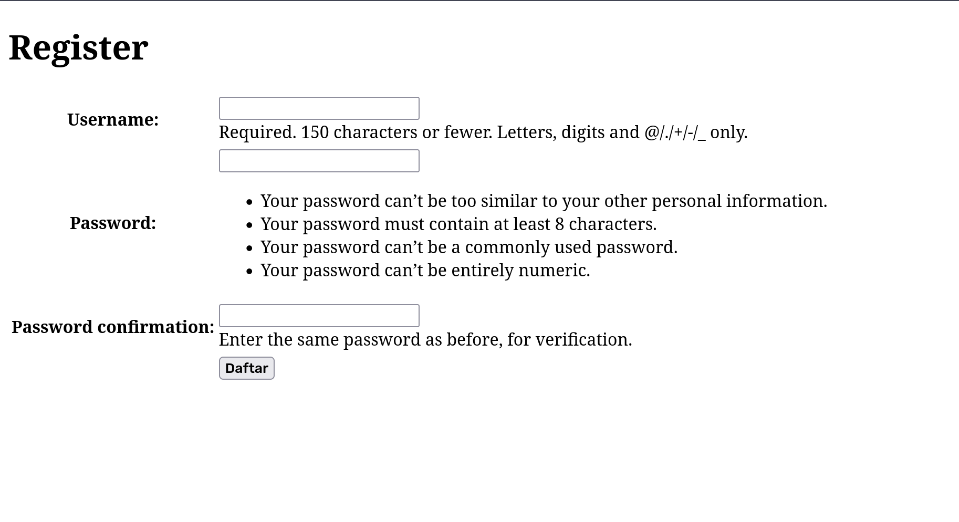
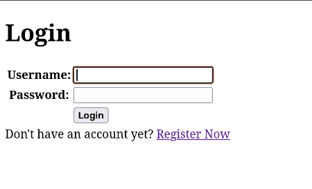
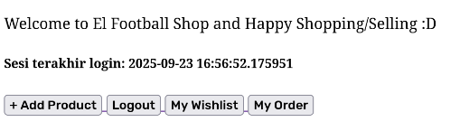
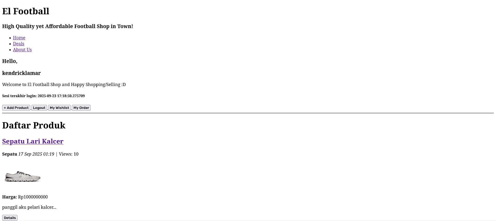
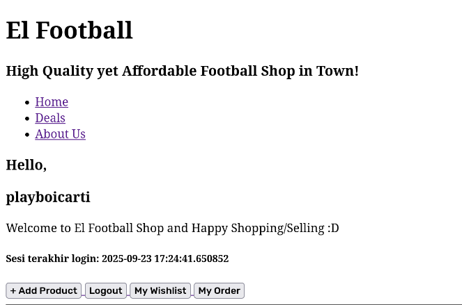
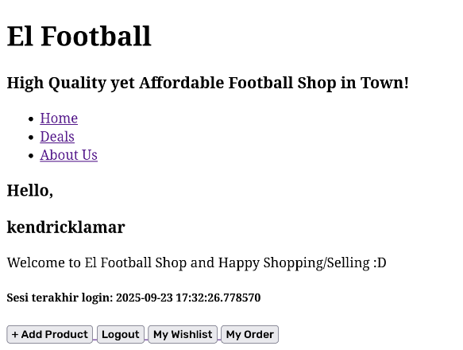
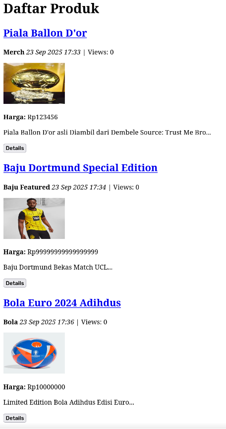
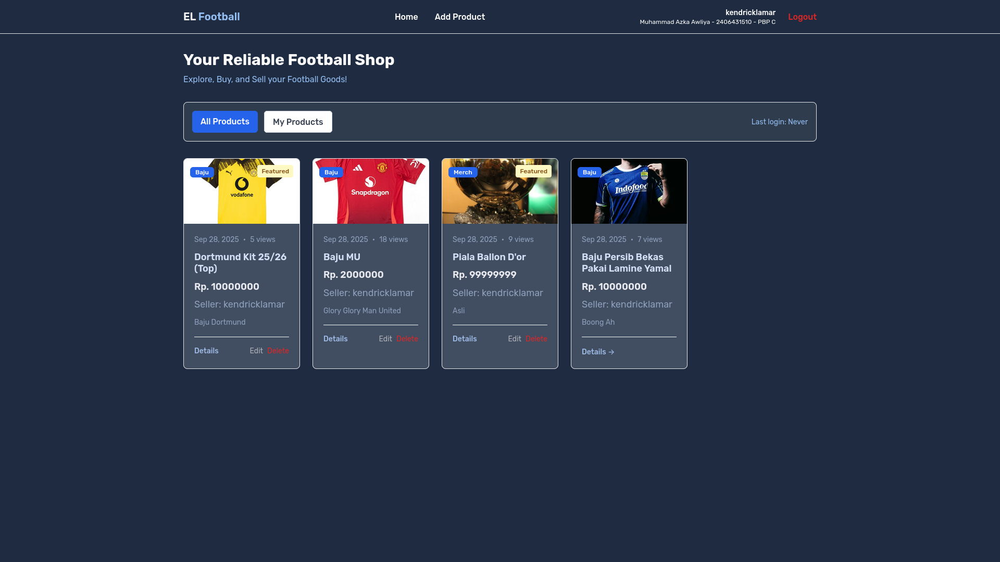

# El Football - Toko Perlengkapan Sepak Bola
## Tugas Individu PBP - Kelas C - 2406431510 - Muhammad Azka Awliya 

Aplikasi dapat diakses melalui tautan berikut: https://muhammad-azka41-elfootball.pbp.cs.ui.ac.id/ \
Nama Aplikasi: El Football

# Esai Tugas 2

## 1. Jelaskan bagaimana cara kamu mengimplementasikan checklist di atas secara step-by-step (bukan hanya sekadar mengikuti tutorial).

1. Membuat Proyek Django Baru
   
   ```
   django-admin startproject el_football
   ```

2. Membuat Aplikasi Baru dengan Nama main

    ```
    python manage.py startapp main
    ```

    Folder main otomatis membentuk beberapa file standar django seperti _ _ init _ _.py, admin.py, apps.py, models.py, tests.py, urls.py, dan views.py.

3. Melakukan Routing Aplikasi main ke Proyek

    - Menambah main ke dalam INSTALLED_APPS di settings.py
    - Membuat file urls.py di dalam folder app main
    - Menghubungkan urls.py milik main ke urls.py milik el_football (folder proyek).

4. Membuat Model Product pada models.py

    ```
    import uuid
    from django.db import models

    class product(models.Model):
        CATEGORY_CHOICES = [
            ('baju', 'Baju'),
            ('sepatu', 'Sepatu'),
            ('bola', 'Bola'),
            ('merch', 'Merch')
        ]

        id = models.UUIDField(primary_key=True, default=uuid.uuid4, editable=False)
        name = models.CharField(max_length=255)
        price = models.IntegerField()
        description = models.TextField()
        thumbnail = models.URLField(blank=True, null=True)
        category = models.CharField(max_length=20, choices=CATEGORY_CHOICES, default='update')
        is_featured = models.BooleanField(default=False)
    ```

5. Membuat Fungsi di views.py
   
   ```
   from django.shortcuts import render

    def show_main(request):
        context = {
            'npm': '2406431510',
            'name' : ' Muhammad Azka Awliya',
            'class' : 'PBP C'
        }

        return render(request, "main.html", context)
   ```

6. Membuat Routing di main/urls.py

    ```
    from django.urls import path, include
    from main.views import show_main

    app_name = 'main'

    urlpatterns = [
        path('', show_main, name='show_main'),
        path('', include('main.urls'))
    ]
    ```

7. Membuat Folder 'templates' dan file main.html di Dalamnya
   
   ```
    <h1>El Football</h1>
    <h3>High Quality yet Affordable Football Shop in Town!</h3>

    <h3>Hello, </h5>
    <h3>{{name}}</h3>

    <nav class="navbar">
        <ul>
            <li><a href="menu">Home</a></li>
            <li><a href="menu">About Us</a></li>
            <li><a href="menu">Discover</a></li>
            <li><a href="menu">Deals</a></li>
            <li><a href="menu">Contact Us</a></li>
        </ul>

        <p>OO Design</p>
    </nav>
   ```

8. Melakukan Deployment ke PWS

    Pada proyek ini, saya menggunakan branch main. Tidak lupa menambahkan file .gitignore untuk tidak memasukkan .env dan .env.prod sebagai target file yang akan di-push oleh git.

    ```
    git init
    git add . 
    git commit -m "Progress Tugas Individu"
    git push origin main
    git push pws main
    ```


## 2. Buatlah bagan yang berisi request client ke web aplikasi berbasis Django beserta responnya dan jelaskan pada bagan tersebut kaitan antara urls.py, views.py, models.py, dan berkas html.


- **urls.py** \
  Bekerja sebagai router yang menentukan view function atau class-based view dimana harus dipanggil setiap request.

- **views.py** \
  Menjadi penghubung utama antara URL, database (model.py) dan tampilan (main.html). View menerima request dari urls.py lalu dapat ambil data dari models.py datau kirim data ke main.html.

- **models.py** \
  Digunakan untuk menfefinisikan struktur database dengan konsep Object-Relational Mapping (ORM).

- **main.html** \
  Berupa file HTML namun mendukung Django Template Language (DTL).

## 3. Jelaskan peran settings.py dalam proyek Django!

**settings.py** adalah pusat konfigurasi proyek dan mendefinisikan cara kerja proyek (database, apps, keamanan, lokasi, template, dan lain sebagainya). Perannya meliputi:

**INSTALLED_APPS**: daftar aplikasi (app) yang aktif dalam proyek — Django akan memuatnya (migrations, admin, template lookup).

**DATABASES**: konfigurasi koneksi database.

**TEMPLATES**: pengaturan engine template, direktori DIRS, context processors.

**MIDDLEWARE**: middleware stack yang memproses request/response (security, session, csrf, dll).

**STATIC & MEDIA**: lokasi file statis HTML dan file upload media.

**DEBUG & ALLOWED_HOSTS**: mode pengembangan/production dan host yang diperbolehkan untuk melayani request.

**SECRET_KEY**: kunci kriptografi untuk session dan security — harus dirahasiakan (jangan commit ke repo publik).

**LOGGING / EMAIL / AUTHENTICATION BACKENDS**: berbagai konfigurasi lain untuk logging, email, otentikasi, dsb.

## 4. Bagaimana cara kerja migrasi database di Django?

a. **Definisikan model di models.py**. Model adalah kelas Python yang mewakili tabel DB.

b. **Buat migration**: 

Django mendeteksi perubahan pada model dan membuat file migration (mis. 0001_initial.py) yang berisi operasi (CreateModel, AddField, AlterField, dsb).
Migration adalah file Python yang mendeskripsikan transformasi skema.
  
    python manage.py makemigrations

c. **Terapkan migration**: 

Django menjalankan operasi migration terhadap database target, membuat/ubah tabel sesuai instruksi migration.
Riwayat migration disimpan di tabel django_migrations sehingga Django tahu migrasi mana yang sudah diterapkan.

    python manage.py migrate

d. **Mengubah model later**: buat perubahan pada models.py, jalankan makemigrations lagi (membuat migration baru seperti 0002_auto...), lalu migrate untuk menerapkannya.

e. **Operasi lanjutan**: ada operasi lanjutan seperti RunPython untuk melakukan data migration, squashmigrations untuk menggabungkan banyak migration menjadi satu, dan rollback memakai migrate app_name migration_name.

## 5. Menurut Anda, dari semua framework yang ada, mengapa framework Django dijadikan permulaan pembelajaran pengembangan perangkat lunak?

a. **“Batteries-included”**: banyak fitur built-in (ORM, admin site, autentikasi, forms, i18n, dsb) sehingga fokus belajar pada konsep web tanpa harus memilih banyak library eksternal.

b. **ORM**: memudahkan interaksi DB tanpa SQL mentah pada tahap awal.

c. **Admin otomatis**: CRUD untuk model bisa langsung tersedia lewat admin, berguna untuk prototyping dan belajar.

d. **Arsitektur jelas (MTV)**: memaksa pemisahan concerns — Model (data), Template (UI), View (logika) — konsep yang mudah dipahami dan berlaku di framework lain juga.

e. **Dokumentasi & komunitas besar**: banyak tutorial, plugin, dan sumber belajar.

f. **Keamanan**: banyak fitur keamanan standar tersedia (CSRF protection, XSS protection, password hashing).

g. **Skalabilitas & produksi-ready**: proyek kecil cepat dibuat, dan framework ini mampu digunakan di proyek besar juga.

h. **Konsistensi**: Django punya konvensi dan struktur proyek yang konsisten sehingga memudahkan pemula mengikuti best practices.

## 6. Apakah ada feedback untuk asisten dosen tutorial 1 yang telah kamu kerjakan sebelumnya?

Selama tutorial 1, asisten dosen turut membantu saya dalam menghadapi suatu permasalahan terutama pada migrasi data. Dari situ saya belajar bahwa setiap penambahan data, diperlukan migrasi basis data setiap perubahan berkala. Asisten dosen membantu saya dengan bahasa yang mudah dipahami, step-by-step, dan well structured. Namun saya memiliki saran untuk menambahkan section khusus untuk mengatasi beberapa error yang biasanya terjadi pada mahasiswa. Sejauh ini, kinerja asisten dosen sudah cukup baik. Terima kasih tim asisten dosen dan tim dosen.

# Esai Tugas 3

## 1. Jelaskan mengapa kita memerlukan data delivery dalam pengimplementasian sebuah platform?

Menurut saya, data delivery atau penyediaan data melalui API denga format terstruktur seperti JSON/XML cukup penting terutama dalam pengembangan web karena:

a. **Decoupling** \
Memisahkan backend (server-side) dari frontend (client-side). Frontend, mobile app, atau pihak ketiga bisa mengonsumsi data yang sama tanpa menautkan ke tampilan HTML server.

b. **Interoperabilitas** \
Banyak klien (browser, mobile, desktop, layanan lain) dapat menggunakan format standar untuk bertukar data.

c. **Skalabilitas dan Reusabilitas** \
Satu sumber data bisa dipakai ulang di banyak tempat (web, app, integrasi pihak ketiga).

d. **Performa dan Optimasi** \
API memudahkan caching, pagination, partial fetching (mis. hanya fields yang perlu), sehingga mengurangi beban.

e. **Keamanan dan Kontrol Akses** \
Endpoint dapat diberi otentikasi/otorisasi terpusat untuk kontrol akses data.

f. **Automasi dan Integrasi** \
Mempermudah integrasi otomatis (cron job, pipeline, service-to-service) dan testing.

## 2. Menurutmu, mana yang lebih baik antara XML dan JSON? Mengapa JSON lebih populer dibandingkan XML?

JSON lebih sederhana dan ringkas dibandingkan XML karena tidak membutuhkan tag pembuka dan penutup yang panjang, sehingga ukuran data lebih kecil dan lebih efisien untuk dikirimkan melalui jaringan. Selain itu, JSON secara alami sudah sesuai dengan struktur object di JavaScript, sehingga mudah diparsing dan diproses di hampir semua bahasa pemrograman modern tanpa membutuhkan library tambahan yang kompleks. JSON juga lebih mudah dibaca manusia karena strukturnya mirip dengan dictionary atau map (key-value), sedangkan XML cenderung lebih verbose dan sulit dibaca. Karena alasan efisiensi, kemudahan penggunaan, dan dukungan luas dari berbagai framework maupun API modern, JSON jauh lebih populer dibandingkan XML.

## 3. Jelaskan fungsi dari method is_valid() pada form Django dan mengapa kita membutuhkan method tersebut?

Fungsi dari method **is_valid()** pada form Django adalah untuk melakukan validasi terhadap data yang dikirimkan pengguna melalui form. Method ini akan mengecek apakah data yang dimasukkan sesuai dengan aturan yang telah ditentukan pada model atau form (misalnya panjang karakter, tipe data, dan field yang wajib diisi). Jika data valid, maka kita bisa memproses dan menyimpannya ke database menggunakan form.save(). Jika tidak valid, Django akan mengembalikan error yang bisa ditampilkan kembali pada form agar pengguna mengetahui kesalahan input.

## 4. Mengapa kita membutuhkan csrf_token saat membuat form di Django? Apa yang dapat terjadi jika kita tidak menambahkan csrf_token pada form Django? Bagaimana hal tersebut dapat dimanfaatkan oleh penyerang?

**csrf_token** dibutuhkan saat membuat form di Django untuk melindungi aplikasi dari serangan Cross-Site Request Forgery (CSRF). Serangan ini memanfaatkan sesi login pengguna agar tanpa sadar mengeksekusi aksi berbahaya seperti menambah, menghapus, atau mengubah data melalui request palsu yang tampak sah. Jika tidak ditambahkan csrf_token, maka request berbahaya tersebut bisa dieksekusi tanpa validasi sehingga penyerang dapat memanipulasi data atau mengendalikan aksi di aplikasi.

## 5. Jelaskan bagaimana cara kamu mengimplementasikan checklist di atas secara step-by-step (bukan hanya sekadar mengikuti tutorial).

1. **Membuat Model** \
Saya menambahkan model Product di main/models.py dengan field seperti **name**, **price**, **description**, **category**, **is_featured**, **is_deals**, **thumbnail**, dan **product_views**. Setelah itu menjalankan python manage.py makemigrations dan python manage.py migrate agar model tersimpan di database db.sqlite3.

2. **Views Sebagai Data Delivery** \
Saya membuat 4 fungsi baru di main/views.py:

    a. **show_xml**:  menampilkan semua data produk dalam format XML. 

    b. **show_json** : menampilkan semua data produk dalam format JSON. 

    c. **show_xml_by_id** : menampilkan data produk tertentu (berdasarkan id) dalam format XML. 

    d. **show_json_by_id** : menampilkan data produk tertentu (berdasarkan id) dalam format JSON. 

3. **Menambah Routing URL** \
Saya menambahkan path untuk semua fungsi views di **main/urls.py**, termasuk juga path untuk **add_product** dan **show_product**.

4. **Membuat Halaman Utama** \
Saya membuat file main.html di main/templates untuk menampilkan daftar produk. Halaman tersebut memiliki tombol Add Product yang mengarah ke form **addpro.html** dan tombol Detail yang mengarah ke halaman detail **product_detail.html**.

5. **Membuat Form Penambahan Produk** \
Saya membuat ProductForm di main/forms.py. Selain itu, saya juga menambahkan fungsi **add_product** di **views.py** yang memproses form dengan **is_valid()**, lalu menyimpan data produk baru ke database.

6. **Membuat Halaman Detail Produk** \
Saya menambahkan fungsi **show_product** di views.py yang menampilkan detail satu produk. Fungsi tersebut juga memanggi method **increment_views()** pada model agar jumlah views bertambah setiap kali detail dibuka. Template **product_detail** pada folder templates memiliki tujuan untuk menampilkan detail produk.

7. **Memanfaatkan Base Template** \
Semua template (**main.html**, **addpro.html**, **product_detail.html**) saya buat extend dari base.html sehingga tampilan konsisten.

8. **Membuat README** \
Membuat README sebagai dokumentasi tugas.

## 6. Apakah ada feedback untuk asdos di tutorial 2 yang sudah kalian kerjakan?

Sejauh ini tidak ada. Para asdos sudah membantu mahasiswanya dengan baik.

## Screenshot Postman


=======

# Esai Tugas 4

## 1. Apa itu Django AuthenticationForm? Jelaskan juga kelebihan dan kekurangannya. 
AuthentificationForm adalah form bawaan Django yang digunakan untuk proses login user. Form ini ada di modul django.contrib.auth.forms. Modul ini bekerja melakukan pencocokan username dan password yang dimasukkan user dengan data pada model User. Modul AuthetificationForm sendiri memiliki fitur salah satunya adalah validasi yang dilakukan secara otomatis.

**Kelebihan** 

a. Merupakan salah satu fitur built-in Django sehingga tidak perlu bikin form validasi login manual.

b. Menangani validasi username/password secara otomatis. 

c. Terintegrasi dengan sistem authentication Django (fungsi authenticate dan login). 

d. Bisa ditambahkan dengan fitur captcha. 

**Kekurangan** 

a. Terbatas hanya pada autentifikasi dasar seperti username dan password. 

b. Perlu membuat/memodifikasi form custom jika membutuhkan autentifikasi lebih kompleks seperti OTP, OAuth, biometrik. 


## 2. Apa perbedaan antara autentikasi dan otorisasi? Bagaiamana Django mengimplementasikan kedua konsep tersebut? 

**Autentifikasi**: Proses memverifikasi identitas user seperti login dengan username dan password. Implementasi autentifikasi di Django meliputi fungsi (authenticate, login, logout), middleware (AuthentificationMiddleware), dan model utama (user). 

**Otorisasi**: Proses memnentukan apakah user yang sudah terautentifikasi punya hak akses untuk melakukan tindakan tertentu. Contohnya hanya admin yang bisa menghapus data user. Beberapa implementasinya di Django meliputi Sistem Permission, Grup, dan Decorator (diawali dengan '@'). 

## 3. Apa saja kelebihan dan kekurangan session dan cookies dalam konteks menyimpan state di aplikasi web? 

**Kelebihan Session** \
Disimpan di sisi server sehingga lebih aman karena data sensitif tidak dikirim ke sisi klien. Session memiliki keunggulan untuk dapat menyimpan data dalam jumlah lebih besar. Selain itu, dukungan Django dalam berbagai backend untuk session database, cache, file, dan lain sebagainya, menjadikan session sebagai sistem autentifikasi Django yang terintegrasi.


**Kekurangan Session** \
Karena data disimpan di sisi server dan biasanya data yang disimpan memiliki ukuran yang cukup besar, penggunaan session juga dapat membebani server. Bahkan, jika server tidak scalable, dapat menyebabkan inkonsistensi.


**Kelebihan Cookies** \
Disimpan di sisi klien (browser) dan data yang digunakan seperti preferensi user, remember-me token, session ID biasanya relatif kecil sehingga tidak membebani server. Selain itu, cookies memiliki jangka penyimpanan yang cukup lama. 

**Kekurangan Cookies** \
Walaupun tidak membebani server karena ukuran datanya yang cukup kecil, hal ini juga disebabkan karena terbatasnya ukuran (4KB per cookie). Selain itu, cookie tergolong rentan dimodifikasi user dan bisa dicuri lewat serangan XSS sehingga tidak aman untuk data sensitif, mengingat cookie menyimpan data kecil berupa detail user dan data disimpan di sisi klien.

## 4. Apakah penggunaan cookies aman secara default dalam pengembangan web, atau apakah ada risiko potensial yang harus diwaspadai? Bagaimana Django menangani hal tersebut? 
Secara default, penggunaan cookies tidak sepenuhnya aman karena berpotensi dicuri via XSS,disadap melalui Man-in-the-Middle dan dimodifikasi oleh user.

Namun, Django memiliki beberapa solusi untuk menangani keamanan cookie dan meminimalisir terjadinya insiden pada cookie, seperti:
a. **SESSION_COOKIE_HTTPONLY** diset ke True. Mencegah JavaScript membaca cookie.

b. **SESSION_COOKIE_SECURE** diset ke True. Cookie hanya dikirim lewat HTTPS.

c. **CSRF_COOKIE_HTTPONLY** diset ke True. Mencegah akses CSRF cookie dari JS.

d. **CSRF_COOKIE_SECURE** diset ke True. Memastikan CSRF token hanya dikirim lewat HTTPS.

e. **SIGNING** pada Django dapat menandatangani cookie (django.core.signing) agar tidak bisa dimodifikasi sembarangan.

## 5. Jelaskan bagaimana cara kamu mengimplementasikan checklist di atas secara step-by-step (bukan hanya sekadar mengikuti tutorial). 

1. **Struktur Proyek** \


2. **Menghubungkan Product dengan User**

```
from django.contrib.auth.models import User
```
Mengimpor model User

```
class Product(models.Model):
    user = models.ForeignKey(User, on_delete=models.CASCADE, null=True)
```
Menambah variable user di dalam model Product

3. **Membuat Fitur Registrasi** 

views.py
```
from django.contrib.auth.forms import UserCreationForm
from django.contrib import messages
```
Mengimpor modul UserCreationForm dan messages

```
def register(request):
    form = UserCreationForm()

    if request.method == "POST":
        form = UserCreationForm(request.POST)
        if form.is_valid():
            form.save()
            messages.success(request, 'Your account has been successfully created!')
            return redirect('main:login')
    context = {'form':form}
    return render(request, 'register.html', context)
```
Mengimplementasi penggunaan kedua modul

Setelah itu, saya membuat register.html sebagai halaman register. \


4. **Membuat Fitur Login**
 
Mengimpor module login di views.py
```
from django.contrib.auth.forms import UserCreationForm, AuthenticationForm
from django.contrib.auth import authenticate, login
```

Membuat fungsi login_user di views.py
```
def login_user(request):
   if request.method == 'POST':
      form = AuthenticationForm(data=request.POST)

      if form.is_valid():
            user = form.get_user()
            login(request, user)
            return redirect('main:show_main')

   else:
      form = AuthenticationForm(request)
   context = {'form': form}
   return render(request, 'login.html', context)
```

Setelah itu, saya membuat login.html sebagai halaman login. \


6. **Membuat Fitur Logout**

Mengimpor module logout di views.py
```
from django.contrib.auth import authenticate, login, logout
```

Membuat fungsi logout_user di views.py
```
def logout_user(request):
    logout(request)
    return redirect('main:login')
```

Lalu saya menambah button logout pada halaman utama
```
...
<a href="">
  <button>Logout</button>
</a>
...
```



\Mengimpor fungsi logout_user ke urls.py
```
from main.views import logout_user
```

Menambah path url ke urlpatterns
```
urlpatterns = [
   ...
   path('logout/', logout_user, name='logout'),
]
```

7. **Menampilkan username dan last_login di halaman utama**

Berikut adalah halaman utama yang menampilkan usernama user setelah login. Sebagai contoh, username yang digunakan adalah 'kendricklamar'. \


Tampilan username akan berubah jika login dengan akun yang berbeda. Contoh username: 'playboicarti' \


8. **Membuat 2 akun pengguna dan 3 dummy product di Local**
Membuat 2 akun pengguna \



Menambah 3 Dummy Product \


9.  **Menambah path di urls.py** 

urls.py
```
from django.urls import path, include
from main.views import show_main, show_xml, show_json, show_xml_by_id, show_json_by_id, add_product, show_product, register, login_user, logout_user

app_name = 'main'

urlpatterns = [
    ...
    path('register/', register, name='register'),
    path('login/', login_user, name='login'),
    path('logout/', logout_user, name='logout'),
]
```

10.  **Pengaturan keamanan cookie di settings.py**

Mengimpor beberapa module ke views.py
```
import datetime
from django.http import HttpResponseRedirect
from django.urls import reverse
```

Mengubah isi dari fungsi login_user dengan menyimpan cookie baru bernama last_login
```
...
if form.is_valid():
    user = form.get_user()
    login(request, user)
    response = HttpResponseRedirect(reverse("main:show_main"))
    response.set_cookie('last_login', str(datetime.datetime.now()))
    return response
...
```

Menambahkan last_login ke dalam context
```
context = {
    ...
    'last_login': request.COOKIES.get('last_login', 'Never')
    ..
}
```

11.   **Melakukan Migrasi** 
    
```
python manage.py makemigrations
```

```
python manage.py migrate
```

11. **Membuat Readme sebagai Dokumentasi Proyek**
Setelah semua checklist selesai, saya mulai menulis dokumentasi proyek di berkas README.md

# Esai Tugas 5

## 1. Jika terdapat beberapa CSS selector untuk suatu elemen HTML, jelaskan urutan prioritas pengambilan CSS selector tersebut!

Jika beberapa CSS selector menarget elemen yang sama, prioritas ditentukan oleh specificity lalu source order. Urutannya sebagai berikut: 

1. aturan !important (paling kuat) 
2. inline style (style="...")  
3. ID selectors (#id) 
4. class/attribute/pseudo-class selectors (.kelas, [attr], :hover) 
5. element/pseudo-element selectors (div, p, ::after);  

bila specificity sama, yang muncul terakhir di stylesheet yang dimuat.

## 2. Mengapa responsive design menjadi konsep yang penting dalam pengembangan aplikasi web? Berikan contoh aplikasi yang sudah dan belum menerapkan responsive design, serta jelaskan mengapa!

Responsive design penting karena pengguna mengakses web dari perangkat dan ukuran layar berbeda — desain responsif memastikan konten terbaca, kegunaan (UX), performa, dan SEO tetap baik tanpa membuat versi terpisah; contoh aplikasi yang sudah responsif: Google, Facebook, Tokopedia — tata letak dan navigasi menyesuaikan layar; contoh yang belum: banyak aplikasi internal/legacy atau situs berita lama yang dibuat hanya untuk desktop, sehingga pada ponsel tampilannya terpotong, tombol sulit diklik, dan navigasi tidak usable.

## 3. Jelaskan perbedaan antara margin, border, dan padding, serta cara untuk mengimplementasikan ketiga hal tersebut!

**Margin** : ruang di luar border yang memberi jarak antar-elemen. \
Contoh Penggunaan: 

```
margin: 16px;
```

**Border** : garis pembatas yang mengelilingi padding dan konten. \
Contoh Penggunaan:

```
border: 1px solid #000;
```

**Padding** : ruang di dalam border antara konten dan border. \
Contoh Penggunaan:

```
padding: 8px 12px;
```

## 4. Jelaskan konsep flex box dan grid layout beserta kegunaannya!
**Flexbox**: dibuat untuk layout satu dimensi (baris atau kolom) sehingga bagus untuk navbar, baris tombol, alignment dan distribusi ruang dengan justify-content/align-items. \
Implementasi:

```
display: flex;
```

**Grid**: untuk layout dua dimensi (baris + kolom) sehingga cocok buat tata letak halaman, gallery, dashboard dengan grid-template-rows/columns. \
Implementasi:

```
display: grid;
```

## 5. Jelaskan bagaimana cara kamu mengimplementasikan checklist di atas secara step-by-step (bukan hanya sekadar mengikuti tutorial)!

1. **Menambah global.css dan script tailwind**

Menggunakan salah satu framework css yaitu tailwind sebagai apperance masing-masing halaman.

```

<!DOCTYPE html>
<html lang="en">
<head>
    <meta charset="UTF-8">
    <meta name="viewport" content="width=device-width, initial-scale=1.0">
     

    <script src="https://cdn.tailwindcss.com"></script>
    <link rel="stylesheet" href="">
</head>

<body>
         
</body>
</html>
```

Memodifikasi apperance form
```
.form-style form input, form textarea, form select {
    width: 100%;
    padding: 0.5rem;
    border: 2px solid #bcbcbc;
    border-radius: 0.375rem;
}
.form-style form input:focus, form textarea:focus, form select:focus {
    outline: none;
    border-color: #5ea7eb;
    box-shadow: 0 0 0 3px #5ea7eb;
}

.form-style input[type="checkbox"] {
    width: 1.25rem;
    height: 1.25rem;
    padding: 0;
    border: 2px solid #d1d5db;
    border-radius: 0.375rem;
    background-color: white;
    cursor: pointer;
    position: relative;
    appearance: none;
    -webkit-appearance: none;
    -moz-appearance: none;
}

.form-style input[type="checkbox"]:checked {
    background-color: #5ea7eb;
    border-color: #5ea7eb;
}

.form-style input[type="checkbox"]:checked::after {
    content: '✓';
    position: absolute;
    top: 50%;
    left: 50%;
    transform: translate(-50%, -50%);
    color: white;
    font-weight: bold;
    font-size: 0.875rem;
}

.form-style input[type="checkbox"]:focus {
    outline: none;
    border-color: #5ea7eb;
    box-shadow: 0 0 0 3px rgba(22, 163, 74, 0.1);
}

```

2. **Menambah Konfigurasi Static Files di Settings.py**

```
MIDDLEWARE = [
    'django.middleware.security.SecurityMiddleware',
    'whitenoise.middleware.WhiteNoiseMiddleware', 
]

STATIC_URL = '/static/'
if DEBUG:
    STATICFILES_DIRS = [
        BASE_DIR / 'static'
    ]
else:
    STATIC_ROOT = BASE_DIR / 'static'
```

3. **Melakukan Styling Apperance untuk Masing-Masing Halaman**

navbar.html
```
<nav class="fixed top-0 left-0 w-full bg-[#1e2b40] border-b border-gray-200 shadow-sm z-50">
    <div class="max-w-7xl mx-auto px-6 lg:px-8">
        <div class="flex items-center justify-between h-16">
            <div class="flex items-center">
                <h1 class="text-xl font-semibold text-white">
                EL<span class="text-[#94bef2]"> Football</span>
                </h1>
            </div>
        
        <!-- Desktop Navigation -->
        <div class="hidden md:flex items-center space-x-8">
            <a href="/" class="text-white hover:text-white font-medium transition-colors">
                Home
            </a>
            
            <a href="" class="text-white hover:text-white font-medium transition-colors">
                Add Product
            </a>
        </div>
        
        <!-- Desktop User Section -->
        <div class="hidden md:flex items-center space-x-6">
            
            <div class="text-right">
                <div class="text-sm font-medium text-white">{{ display_name|default:user.username }}</div>
                <div class="text-xs text-white">{{ name|default:user.username }} - {{ npm|default:"Student" }} - {{ class|default:"Class" }}</div>
            </div>
            <a href="" class="text-red-600 hover:text-red-700 font-medium transition-colors">
                Logout
            </a>
            
            <a href="" class="text-white hover:text-white-900 font-medium transition-colors">
                Login
            </a>
            <a href="" class="bg-green-600 hover:bg-green-700 text-white px-4 py-2 rounded font-medium transition-colors">
                Register
            </a>
            
        </div>
        
        <!-- Mobile Menu Button -->
        <div class="md:hidden flex items-center">
            <button class="mobile-menu-button p-2 text-white hover:text-white-900 transition-colors">
            <span class="sr-only">Open menu</span>
            <div class="w-6 h-6 flex flex-col justify-center items-center">
                <span class="bg-current block transition-all duration-300 ease-out h-0.5 w-6 rounded-sm"></span>
                <span class="bg-current block transition-all duration-300 ease-out h-0.5 w-6 rounded-sm my-0.5"></span>
                <span class="bg-current block transition-all duration-300 ease-out h-0.5 w-6 rounded-sm"></span>
            </div>
            </button>
        </div>
        </div>
    </div>
    <!-- Mobile Menu -->
    <div class="mobile-menu hidden md:hidden bg-white border-t border-gray-200">
        <div class="px-6 py-4 space-y-4">
        <!-- Mobile Navigation Links -->
        <div class="space-y-1">
            <a href="/" class="block text-white-600 hover:text-blue font-medium py-3 transition-colors">
            Home
            </a>
            
            <a href="" class="block text-white hover:text-blue font-medium py-3 transition-colors">
            Add Product
            </a>
        </div>
        
        <!-- Mobile User Section -->
        <div class="border-t border-gray-200 pt-4">
            
            <div class="mb-4">
                <div class="font-medium text-white">{{ display_name|default:user.username }}</div>
                <div class="text-sm text-white-500">{{ name|default:user.username }} - {{ npm|default:"Student" }} - {{ class|default:"Class" }}</div>
            </div>
            <a href="" class="block text-red-600 hover:text-red-700 font-medium py-3 transition-colors">
                Logout
            </a>
            
            <div class="space-y-3">
                <a href="" class="block text-white-600 hover:text-white-900 font-medium py-3 transition-colors">
                    Login
                </a>
    
                <a href="" class="block bg-green-600 hover:bg-green-700 text-white font-medium py-3 px-4 rounded text-center transition-colors">
                    Register
                </a>
            </div>
            
            </div>
        </div>
    </div>
    <script>
        const btn = document.querySelector("button.mobile-menu-button");
        const menu = document.querySelector(".mobile-menu");
    
        btn.addEventListener("click", () => {
        menu.classList.toggle("hidden");
        });
    </script>
</nav>
```

login.html
```



<title>Login - El Football</title>



<div class="bg-[#1e2b40] w-full min-h-screen flex items-center justify-center p-8">
  <div class="max-w-md w-full">
    <div class="bg-[#2c3e5c] rounded-lg border border-gray-200 p-6 sm:p-8 form-style">
      <div class="text-center mb-8">
        <h1 class="text-2xl font-bold text-white mb-2">Sign In</h1>
        <p class="text-[#94bef2]">Welcome back to El Football</p>
      </div>

      <!-- Form Errors Display -->
      
        <div class="mb-6">
          
            <div class="px-4 py-3 rounded-md text-sm border bg-red-50 border-red-200 text-red-700">
              {{ error }}
            </div>
          
        </div>
      

      
        <div class="mb-6">
          
            
              
                <div class="px-4 py-3 rounded-md text-sm border bg-red-50 border-red-200 text-red-700 mb-2">
                  <strong>{{ field|title }}:</strong> {{ error }}
                </div>
              
            
          
        </div>
      

      <form method="POST" action="" class="space-y-6">
        
        
        <div>
          <label for="username" class="block text-sm font-medium text-gray-700 mb-2">Username</label>
          <input 
            id="username" 
            name="username" 
            type="text" 
            required 
            class="w-full px-4 py-3 border border-gray-300 rounded-md focus:outline-none focus:border-blue-500 transition-colors" 
            placeholder="Enter your username">
        </div>

        <div>
          <label for="password" class="block text-sm font-medium text-gray-700 mb-2">Password</label>
          <input 
            id="password" 
            name="password" 
            type="password" 
            required 
            class="w-full px-4 py-3 border border-gray-300 rounded-md focus:outline-none focus:border-blue-500 transition-colors" 
            placeholder="Enter your password">
        </div>

        <button 
          type="submit" 
          class="w-full bg-blue-600 text-white font-medium py-3 px-4 rounded-md hover:bg-blue-700 transition-colors">
          Sign In
        </button>
      </form>

      <!-- Messages Display -->
      
        <div class="mt-6">
          
            <div 
              class="
                px-4 py-3 rounded-md text-sm border
                
                  bg-blue-50 border-blue-200 text-blue-700
                
                  bg-red-50 border-red-200 text-red-700
                
                  bg-gray-50 border-gray-200 text-gray-700
                
              ">
              {{ message }}
            </div>
          
        </div>
      

      <div class="mt-6 text-center pt-6 border-t border-gray-200">
        <p class="text-[#94bef2] text-sm">
          Don't have an account? 
          <a href="" class="text-[#9ebbe6] hover:text-blue-700 font-medium">
            Register Now
          </a>
        </p>
      </div>
    </div>
  </div>
</div>

```

register.html
```



<title>Register - El Football</title>



<div class="form-style">
  <div class="min-h-screen bg-[#1e2b40] flex items-center justify-center p-8">
    <div class="max-w-md w-full relative z-10">
      <div class="bg-[#2c3e5c] border border-gray-200 rounded-lg p-8 shadow-sm">
      <div class="text-center mb-8">
        <h2 class="text-2xl font-semibold text-white mb-2">Home of Football Goods!</h2>
        <p class="text-[#94bef2]">Explore, Buy or Sell your Football Stuff</p>
      </div>

      <!-- Form Errors Display -->
      
        <div class="mb-6">
          
            <div class="px-4 py-3 rounded text-sm border bg-red-50 border-red-200 text-red-700">
              {{ error }}
            </div>
          
        </div>
      

      
        <div class="mb-6">
          
            
              
                <div class="px-4 py-3 rounded text-sm border bg-red-50 border-red-200 text-red-700 mb-2">
                  <strong>{{ field|title }}:</strong> {{ error }}
                </div>
              
            
          
        </div>
      

      <form method="POST" action="" class="space-y-5">
        
        
        <div>
          <label for="username" class="block text-sm font-medium text-gray-700 mb-2">Username</label>
          <input 
            id="username" 
            name="username" 
            type="text" 
            required 
            class="w-full px-4 py-3 border border-gray-300 rounded focus:outline-none focus:border-blue-500 transition duration-200" 
            placeholder="Choose a username">
        </div>

        <div>
          <label for="password1" class="block text-sm font-medium text-gray-700 mb-2">Password</label>
          <input 
            id="password1" 
            name="password1" 
            type="password" 
            required 
            class="w-full px-4 py-3 border border-gray-300 rounded focus:outline-none focus:border-blue-500 transition duration-200" 
            placeholder="Create a password">
        </div>

        <div>
          <label for="password2" class="block text-sm font-medium text-gray-700 mb-2">Confirm Password</label>
          <input 
            id="password2" 
            name="password2" 
            type="password" 
            required 
            class="w-full px-4 py-3 border border-gray-300 rounded focus:outline-none focus:border-blue-500 transition duration-200" 
            placeholder="Confirm your password">
        </div>

        <button 
          type="submit" 
          class="w-full bg-blue-600 text-white font-medium py-3 px-4 rounded hover:bg-blue-700 focus:outline-none focus:ring-2 focus:ring-blue-500 focus:ring-offset-2 transition duration-200">
          Create Account
        </button>
      </form>

      <!-- Messages Display -->
      
        <div class="mt-6">
          
            <div 
              class="
                px-4 py-3 rounded text-sm border
                
                  bg-blue-50 border-blue-200 text-blue-700
                
                  bg-red-50 border-red-200 text-red-700
                
                  bg-gray-50 border-gray-200 text-gray-700
                
              ">
              {{ message }}
            </div>
          
        </div>
      

      <div class="mt-6 text-center">
        <p class="text-[#94bef2] text-sm">
          Already have an account? 
          <a href="" class="text-[#9ebbe6] hover:text-blue-700 font-medium">
            Sign In
          </a>
        </p>
      </div>
      </div>
    </div>
  </div>
</div>

```

card_product.html
```

<article class="bg-[#414d61] rounded-lg border border-gray-200 hover:shadow-lg transition-shadow duration-300 overflow-hidden">
  <!-- Thumbnail -->
  <div class="aspect-[16/9] relative overflow-hidden">
    
      
    
      <div class="w-full h-full bg-gray-200"></div>
    

    <!-- Category Badge -->
    <div class="absolute top-3 left-3">
      <span class="inline-flex items-center px-2.5 py-0.5 rounded-md text-xs font-medium bg-blue-600 text-white">
        {{ product.get_category_display }}
      </span>
    </div>

    <!-- Status Badges -->
    <div class="absolute top-3 right-3 flex space-x-2">
      
        <span class="inline-flex items-center px-2 py-1 rounded text-xs font-medium bg-yellow-100 text-yellow-800">
          Featured
        </span>
      
    </div>
  </div>

  <!-- Content -->
  <div class="p-5">
    <div class="flex items-center text-sm text-[#8d9fba] mb-3">
      <time datetime="{{ product.created_at|date:'c' }}">
        {{ product.created_at|date:"M j, Y" }}
      </time>
      <span class="mx-2">•</span>
      <span>{{ product.product_views }} views</span>
    </div>

    <h3 class="text-lg font-semibold text-[#d3dff5] mb-3 line-clamp-2 leading-tight">
      <a href="" class="hover:text-[#809cd1] transition-colors">
        {{ product.name }}
      </a>
    </h3>

    <h3 class="text-lg font-semibold text-[#e9eaf0] mb-3 line-clamp-2 leading-tight">
      <a href="">
        Rp. {{ product.price }}
      </a>
    </h3>

    <h5 class="text-lg font-500 text-[#8d9fba] mb-3 line-clamp-2 leading-tight">
      <a href="">
        Seller: {{ display_name|default:user.username }}
      </a>
    </h5>

    <p class="text-[#8d9fba] text-sm leading-relaxed line-clamp-3 mb-4">
      {{ product.description|truncatewords:20 }}
    </p>

    <!-- Action Buttons -->
    
      <div class="flex items-center justify-between pt-4 border-t border-gray-100">
        <a href="" class="text-[#9ebbe6] hover:text-[#566b8c] font-medium text-sm transition-colors">
          Details
        </a>
        <div class="flex space-x-2">
          <a href="" class="text-[#aeb2b8] hover:text-[#566b8c] text-sm transition-colors">
            Edit 
          </a>
          <a href="" class="text-red-600 hover:text-red-700 text-sm transition-colors">
            Delete
          </a>
        </div>
      </div>
    
      <div class="pt-4 border-t border-gray-100">
        <a href="" class="text-[#9ebbe6] hover:text-[#566b8c] font-medium text-sm transition-colors">
          Details →
        </a>
      </div>
    
  </div>
</article>
```

main.html
```




<title>EL Football</title>




<div class="bg-[#1e2b40] w-full pt-16 min-h-screen">
  <div class="max-w-7xl mx-auto px-4 sm:px-6 lg:px-8 py-8">

    <!-- Header Section -->
    <div class="mb-8">
      <h1 class="text-3xl font-bold text-white mb-2">Your Reliable Football Shop</h1>
      <p class="text-[#94bef2]">Explore, Buy, and Sell your Football Goods!</p>
    </div>

    <!-- Filter Section -->
    <div class="flex flex-col sm:flex-row sm:items-center sm:justify-between mb-8 bg-[#2e3c4d] rounded-lg border border-gray-200 p-4">
      <div class="flex space-x-3 mb-4 sm:mb-0">
        <a href="?" class=" bg-blue-600 text-whitebg-white text-gray-700 border border-gray-300 px-4 py-2 rounded-md font-medium transition-colors hover:bg-blue-600 hover:text-white">
          All Products
        </a>
        <a href="?filter=my" class=" bg-blue-600 text-whitebg-white text-gray-700 border border-gray-300 px-4 py-2 rounded-md font-medium transition-colors hover:bg-blue-600 hover:text-white">
          My Products
        </a>
      </div>
      
        <div class="text-sm text-[#94bef2]">
          Last login: {{ last_login }}
        </div>
      
    </div>

    
      <div class="bg-[#1e2b40] rounded-lg border border-gray-200 p-12 text-center">
        <div class="w-32 h-32 mx-auto mb-4">
          
        </div>
        <h3 class="text-lg font-medium text-white mb-2">No product found</h3>
        <p class="text-[#94bef2] mb-6">Add your First Product!</p>
        <a href="" class="inline-flex items-center px-4 py-2 bg-blue-600 text-white rounded-md hover:bg-blue-700 transition-colors">
          Add Product
        </a>
      </div>
      
      
      <div class="grid grid-cols-1 sm:grid-cols-2 md:grid-cols-3 lg:grid-cols-4 xl:grid-cols-5 gap-6">
        
          
        
      </div>
    

  </div>
</div>

```

product_detail.html
```




<title>{{ product.name|default:"Product" }} - El Football</title>



<div class="bg-[#1e2b40] w-full min-h-screen">
  <div class="max-w-6xl mx-auto px-4 sm:px-6 lg:px-8 py-8">

    <!-- Back -->
    <div class="mb-6">
      <a href="" class="text-[#94bef2] hover:text-gray-900 font-medium transition-colors">
        ← Back to product
      </a>
    </div>

    <!-- Card -->
    <article class="bg-[#1e2b40] rounded-lg border border-gray-200 overflow-hidden">
      <!-- Header -->
      <div class="p-6 sm:p-8">
        <div class="flex flex-wrap items-center gap-2 mb-4">
          <span class="inline-flex items-center px-3 py-1 rounded-md text-xs font-medium bg-blue-600 text-white">
            {{ product.get_category_display }}
          </span>
          
            <span class="inline-flex items-center px-3 py-1 rounded-md text-xs font-medium bg-yellow-100 text-yellow-800">Featured</span>
          
          
            <span class="inline-flex items-center px-3 py-1 rounded-md text-xs font-medium bg-red-100 text-red-800">Hot</span>
          
        </div>

        <h1 class="text-3xl sm:text-4xl font-bold text-gray-900 leading-tight mb-3">
          {{ product.name }}
        </h1>

        <div class="flex flex-wrap items-center text-sm text-gray-500 gap-4">
          <time datetime="{{ product.created_at|date:'c' }}">
            {{ product.created_at|date:"M j, Y g:i A" }}
          </time>
          <span>•</span>
          <span>{{ product.product_views|default:0 }} views</span>
        </div>
      </div>

      <!-- Image (URLField) -->
      
        <div class="px-6 sm:px-8">
          {# karena thumbnail adalah URLField, gunakan langsung product.thumbnail #}
          
        </div>
      
        {# fallback image statis #}
        <div class="px-6 sm:px-8">
          
        </div>
      

      <!-- Content -->
      <div class="p-6 sm:p-8">
        <div class="prose prose-lg max-w-none">
          <div class="text-gray-900 leading-relaxed whitespace-pre-line text-base sm:text-lg mb-4">
            {{ product.name }}
          </div>

          <div class="text-[#94bef2] leading-relaxed whitespace-pre-line text-base sm:text-lg mb-4 font-semibold text-xl">
            
              Rp. {{ product.price}}
            
              Rp. -
            
          </div>

          <div class="text-gray-700 leading-relaxed whitespace-pre-line text-base sm:text-lg mb-4">
            
              {{ product.description }}
            
              No description provided.
            
          </div>

          <div class="flex items-center gap-3 mt-4">
            
              <a href="" class="px-4 py-2 border border-gray-300 rounded-md text-sm hover:bg-gray-50">Details</a>
            

            
              <a href="" class="px-4 py-2 bg-blue-600 text-white rounded-md text-sm hover:bg-blue-700">Edit</a>
              <a href="" class="px-4 py-2 bg-red-100 text-red-700 rounded-md text-sm hover:bg-red-200">Delete</a>
            
          </div>
        </div>
      </div>

      <!-- Author -->
      <div class="border-t border-gray-200 p-6 sm:p-8 bg-[#1e2b40]">
        <div class="flex items-center justify-between">
          <div>
            <div class="font-medium text-white">
              
                <p>Author: {{ product.user.username }}</p>
              
                <p>Author: Anonymous</p>
              
            </div>
            <p class="text-sm text-[#94bef2]">Author</p>
          </div>
        </div>
      </div>
    </article>
  </div>
</div>

```

addpro.html
```


<title>Add Product - El Football</title>



<div class="bg-[#1e2b40] w-full min-h-screen">
  <div class="max-w-3xl mx-auto px-4 sm:px-6 lg:px-8 py-8">
    
    <!-- Back Navigation -->
    <div class="mb-6">
      <a href="" class="text-[#94bef2] hover:text-gray-900 font-medium transition-colors">
        ← Back to Product List
      </a>
    </div>
    
    <!-- Form -->
    <div class="bg-[#1e2b40] rounded-lg border border-gray-200 p-6 sm:p-8 form-style">
      <div class="mb-8">
        <h1 class="text-2xl font-bold text-white mb-2">Add New Product</h1>
        <p class="text-[#94bef2]">Sell your Football Stuff and Get Profit!</p>
      </div>
      
      <form method="POST" class="space-y-6">
        
        
          <div>
            <label for="{{ field.id_for_label }}" class="block text-sm font-medium text-[#94bef2] mb-2">
              {{ field.label }}
            </label>
            <div class="w-full">
              {{ field }}
            </div>
            
              <p class="mt-1 text-sm text-gray-500">{{ field.help_text }}</p>
            
            
              <p class="mt-1 text-sm text-red-600">{{ error }}</p>
            
          </div>
        
        
        <div class="flex flex-col sm:flex-row gap-4 pt-6 border-t border-gray-200">
          <a href="" class="order-2 sm:order-1 px-6 py-3 border border-gray-300 text-gray-700 rounded-md font-medium hover:bg-gray-50 transition-colors text-center">
            Cancel
          </a>
          <button type="submit" class="order-1 sm:order-2 flex-1 bg-blue-600 text-white px-6 py-3 rounded-md font-medium hover:bg-blue-700 transition-colors">
            Deploy Product
          </button>
        </div>
      </form>
    </div>
  </div>
</div>

```

edit_product.html
```




<title>Edit Product Detail - El Football</title>



<div class="bg-[#1e2b40] w-full min-h-screen">
  <div class="max-w-3xl mx-auto px-4 sm:px-6 lg:px-8 py-8">
    
    <!-- Back Navigation -->
    <div class="mb-6">
      <a href="" class="text-[#94bef2] hover:text-gray-900 font-medium transition-colors">
        ← Back to Product List
      </a>
    </div>
    
    <!-- Form -->
    <div class="bg-[#1e2b40] rounded-lg border border-gray-200 p-6 sm:p-8 form-style">
      <div class="mb-8">
        <h1 class="text-2xl font-bold text-white mb-2">Edit Detail</h1>
        <p class="text-[#94bef2]">Update your Product Details!</p>
      </div>
      
      <form method="POST" class="space-y-6">
        
        
          <div>
            <label for="{{ field.id_for_label }}" class="block text-sm font-medium text-[#94bef2] mb-2">
              {{ field.label }}
            </label>
            <div class="w-full">
              {{ field }}
            </div>
            
              <p class="mt-1 text-sm text-gray-500">{{ field.help_text }}</p>
            
            
              <p class="mt-1 text-sm text-red-600">{{ error }}</p>
            
          </div>
        
        
        <div class="flex flex-col sm:flex-row gap-4 pt-6 border-t border-gray-200">
          <a href="" class="order-2 sm:order-1 px-6 py-3 border border-gray-300 text-[#94bef2] rounded-md font-medium hover:bg-gray-50 transition-colors text-center">
            Cancel
          </a>
          <button type="submit" class="order-1 sm:order-2 flex-1 bg-blue-600 text-white px-6 py-3 rounded-md font-medium hover:bg-blue-700 transition-colors">
            Update Details
          </button>
        </div>
      </form>
    </div>
  </div>
</div>

```

4. **Membuat README.md sebagai dokumentasi **

Tampilan Halaman
